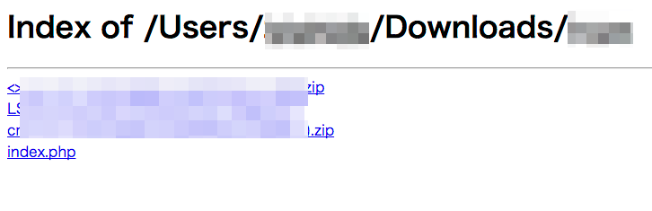

# directory index を表示するだけのやつ

PHP -SがDirectory indexしてくれなくて不便なので



## usage

``` 
$ cd /tmp/
$ git clone git@github.com:uzulla/php_directory_index.git
$ cd /path/to/as_you_like
$ php -S 0.0.0.0:8080 /tmp/php_directory_/index.php
```

`https://raw.githubusercontent.com/uzulla/php_directory_index/master/index.php`
をコピペしてもよい

